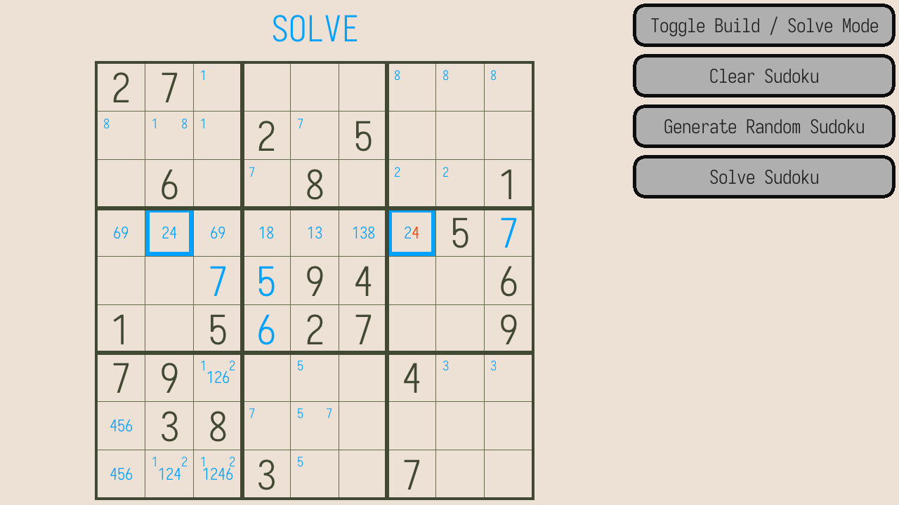
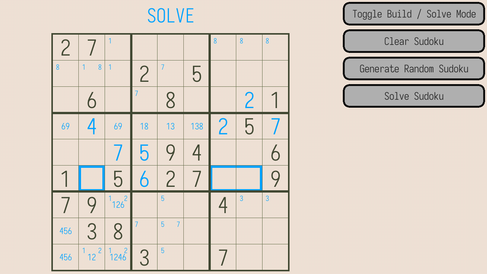
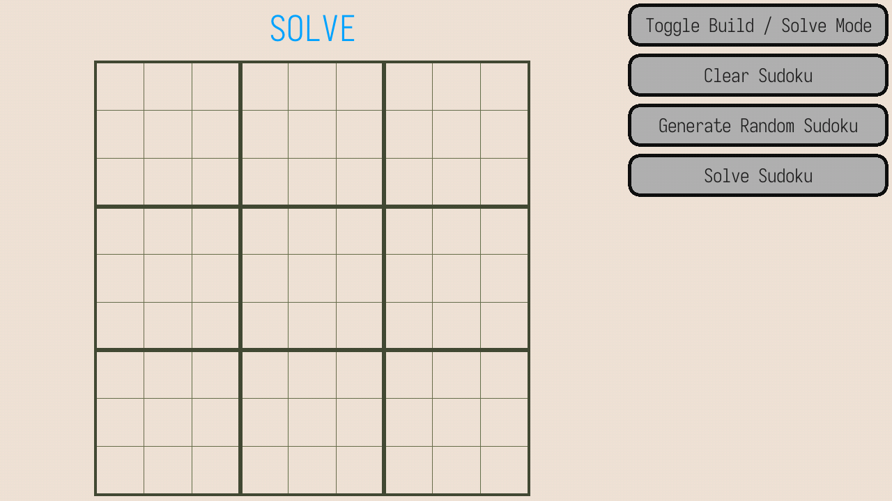

# Stylish Sudoku

A simple stylish sudoku player.




## Quick Start

```bash
# compile the build script once.
$ cc -o nob nob.c

# compile and run
$ ./nob debug && ./build/main_debug
```

## Featuring...

### Cool Selection Animations!

*TODO gif of cool selections animations, maybe 4 at once, do some editing*

### Sudoku Logic!

This helpfully shows when you incorrectly placed a digit




#### Including A Sudoku Solver

It really works! It can also tell when a sudoku is not unique!

I'll add more features to this later, as well as a better visualization.


### Randomly Generated Sudoku's!

I mean... they're probably not that fun to solve... but they are valid unique sudoku. That probably counts for something...




### Auto Saves && Undo/Redo

a standard feature

*NOTE: web version dose not know about local storage yet, and cannot save. TODO do that*


### Sounds!

Trust me on this one.

*TODO actually implement sounds*


### A Web Version!

Currently buggy as all hell. (the mouse doesn't work among other things)

*TODO maybe put an image here?*

